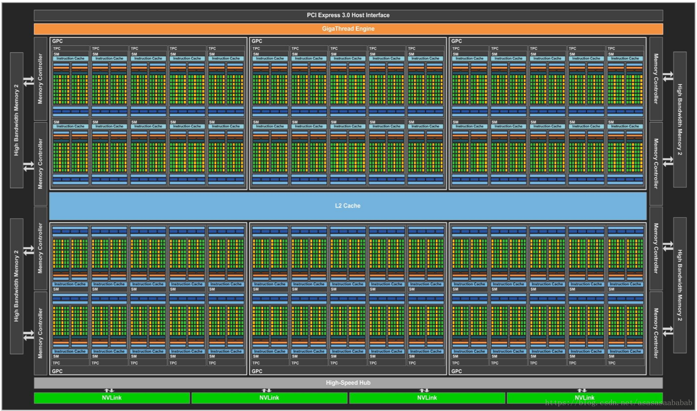

## Reference
[0] [https://github.com/ChambinLee/CUDA_with_PyTorch](https://github.com/ChambinLee/CUDA_with_PyTorch)

[1] [Cheng, John, Max Grossman, and Ty McKercher. *Professional CUDA c programming*. John Wiley & Sons, 2014.](https://books.google.com.hk/books?hl=en&lr=&id=q3DvBQAAQBAJ&oi=fnd&pg=PR17&dq=Professional+CUDA+C+Programming&ots=Kio2_nzxI1&sig=wo3a06_kK3QepKxMsVHIG4qk3Hk&redir_esc=y&hl=zh-CN&sourceid=cndr#v=onepage&q=Professional%20CUDA%20C%20Programming&f=false)

[2] [人工智能编程|谭升的博客](https://face2ai.com/program-blog/#GPU%E7%BC%96%E7%A8%8B%EF%BC%88CUDA%EF%BC%89)

[3] [NVIDIA CUDA C++ Programming Guide](https://docs.nvidia.com/cuda/cuda-c-programming-guide/index.html)

[4] [CUSTOM C++ AND CUDA EXTENSIONS](https://pytorch.org/tutorials/advanced/cpp_extension.html)

[5] [Neural Network CUDA Example](https://github.com/godweiyang/NN-CUDA-Example)

