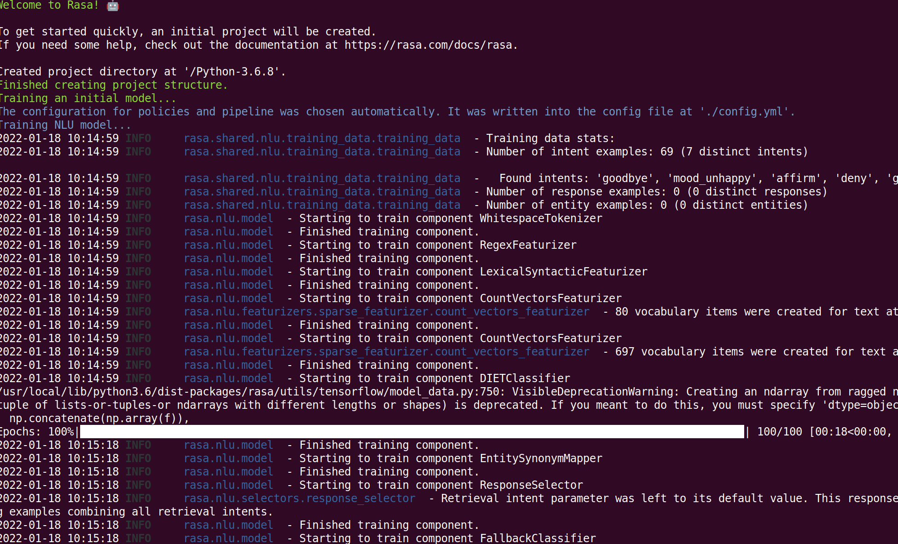
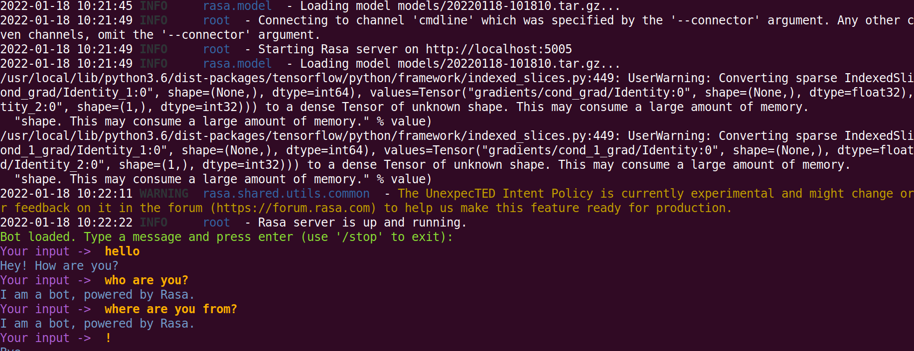
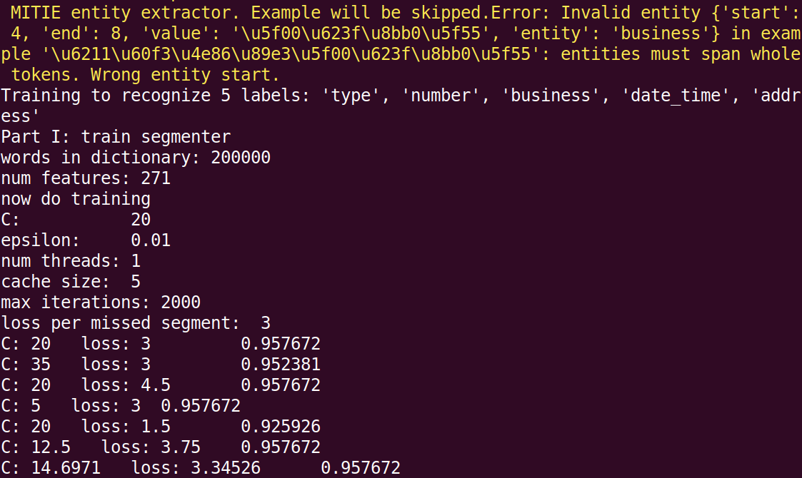

目录
=================

* [rasa部署](#rasa部署)
   * [anaconda3环境配置安装rasa](#anaconda3环境配置安装rasa)
   * [使用虚拟环境安装与配置](#使用虚拟环境安装与配置)
   * [测试rasa助手](#测试rasa助手)
   * [安装其他依赖](#安装其他依赖)
* [训练模型](#训练模型)
   * [测试数据集来源：](#测试数据集来源)
   * [使用MITIE](#使用mitie)
   * [使用Supervised_Embedding](#使用supervised_embedding)
   * [使用MITIE+Supervised_Embedding](#使用mitiesupervised_embedding)
* [运行服务测试rasa](#运行服务测试rasa)
   * [1）启动Rasa服务](#1启动rasa服务)
   * [2）启动Action服务](#2启动action服务)
   * [3）启动server.py服务](#3启动serverpy服务)
* [附件](#附件)
   * [安装poetry](#安装poetry)
 


# rasa部署
参考资料：\
[https://blog.csdn.net/AndrExpert/article/details/104328946](https://blog.csdn.net/AndrExpert/article/details/104328946) \
[https://github.com/jiangdongguo/ChitChatAssistant](https://github.com/jiangdongguo/ChitChatAssistant)\
docker pull meadml/cuda10.1-cudnn7-devel-ubuntu18.04-python3.6\
安装cuda10.1+cudnn7+anaconda3+conda create -n py36 python=3.6\
如果考虑GPU则安装：pip install tensorflow-gpu==2.3.0 -i  https://pypi.doubanio.com/simple/  --trusted-host pypi.doubanio.com \
conda install pytorch==1.5.1 torchvision==0.6.1 cudatoolkit=10.1 -c pytorch 

关于构建docker容器的方法与教程直接参考我的博客文章即可：[https://blog.csdn.net/weixin_41194129/category_11178137.html](https://blog.csdn.net/weixin_41194129/category_11178137.html)

## anaconda3环境配置安装rasa
```shell
anaconda3镜像源：终端输入
conda config --add channels https://mirrors.tuna.tsinghua.edu.cn/anaconda/pkgs/free/c
conda config --set show_channel_urls yes
conda config --add channels https://mirrors.tuna.tsinghua.edu.cn/anaconda/cloud/conda-forge/
conda config --add channels https://mirrors.tuna.tsinghua.edu.cn/anaconda/cloud/msys2/


开始安装：
如果不考虑GPU则安装：pip install tensorflow==2.6.2 -i  https://pypi.doubanio.com/simple/ --trusted-host pypi.doubanio.com 
pip --default-timeout=1000 install rasa # 安装时间可能会很长，可以考虑下面的安装方式或安装其他官方需要是依赖。
pip --default-timeout=500 install -U rasa -i  https://pypi.doubanio.com/simple/ --trusted-host pypi.doubanio.com
补充：指定安装版本：pip install rasa==1.9.5  #对应tensorflow2.2

生成文件
$ sudo rasa init --no-prompt

旧版(含有requirements.txt)从源码安装：
git clone https://github.com/RasaHQ/rasa.git
cd rasa
pip install -r requirements.txt -i https://pypi.doubanio.com/simple/ --trusted-host pypi.doubanio.com
pip install -e .

新版：如果要使用 Rasa Open Source 的开发版，可以从 GitHub 获取：
apt install curl git
pip install httpx  && pip install --upgrade httpx
curl -sSL https://raw.githubusercontent.com/python-poetry/poetry/master/get-poetry.py | python
或
curl -sSL https://raw.githubusercontent.com/python-poetry/poetry/master/install-poetry.py | python -
如果提示安装成功了却无法使用，则使用命令升级：pip install --upgrade poetry 
pip install poetry pytest-sanic==1.1.0
git clone https://github.com/RasaHQ/rasa.git
cd rasa
poetry install

make编译安装：cd rasa
export PYTHONIOENCODING=utf-8;make install

```

验证是否安装成功：
```shell
Python 3.6.8 (default, Dec  8 2021, 21:08:43) 
[GCC 8.4.0] on linux
Type "help", "copyright", "credits" or "license" for more information.
>>> import rasa
>>> rasa.__version__
'2.8.21'

```


## 使用虚拟环境安装与配置

```shell
如果自带python3.6就无需安装直接安装rasa相关模块即可 。
sudo apt-get install openssl libssl-dev
sudo wget https://www.python.org/ftp/python/3.6.8/Python-3.6.8.tgz
sudo tar xzf Python-3.6.8.tgz
cd Python-3.6.8
sudo ./configure --with-ssl --enable-optimizations
sudo make
sudo make install
如果需要使用其他版本，也是通过以下两个命令实现，只是python3.6改成其他版本
sudo rm /usr/bin/python
sudo ln -s /usr/local/bin/python3.6 /usr/bin/python
生成pip快捷方式，以支持pip命令
rm /usr/bin/pip
sudo ln -s /usr/local/bin/pip3 /usr/bin/pip
sudo apt-get update
sudo sed -i s@/archive.ubuntu.com/@/mirrors.aliyun.com/@g /etc/apt/sources.list
sudo apt update --fix-missing

安装pipEnv，即创建虚拟环境
# 安装virtualenv
sudo pip install virtualenv
# 创建virtualenv快捷方式
# 如果不清楚virtualenv路径，可使用"find / -name virtualenv"命令查询
sudo ln -s /usr/local/python3/bin/virtualenv /usr/bin/virtualenv
# 查看是否安装成功
sudo virtualenv --version
# 如果已经存在pip.conf文件，只需要执行第二步即可
sudo mkdir ~/.pip
sudo vim ~/.pip/pip.conf

创建新的项目，运行在python虚拟环境
sudo mkdir chitchat_assistant
cd chitchat_assistant
sudo virtualenv env
sudo source env/bin/activate
如果不适用则：sudo deactivate

安装rasa，自动生成rasa项目所需文件
# 安装rasa, 由于网络问题，延长超时时间
# 如果仍然超时异常，多执行几次
sudo pip --default-timeout=500 install -U rasa
pip install colorama
# 生成文件
sudo apt-get install language-pack-zh-hans
export PYTHONIOENCODING=utf-8;rasa init --no-prompt
``` 

## 测试rasa助手


```shell
使用下面是utf-8编码：
export PYTHONIOENCODING=utf-8;rasa init --no-prompt
```


最后在指定路径下生成相应demo模型： 
```shell
Epochs:   0%|                                                                                                                                           | 0/100 [00:00<?, ?it/s]/usr/local/lib/python3.6/dist-packages/tensorflow/python/framework/indexed_slices.py:449: UserWarning: Converting sparse IndexedSlices(IndexedSlices(indices=Tensor("gradients/cond_grad/Identity_1:0", shape=(None,), dtype=int64), values=Tensor("gradients/cond_grad/Identity:0", shape=(None,), dtype=float32), dense_shape=Tensor("gradients/cond_grad/Identity_2:0", shape=(1,), dtype=int32))) to a dense Tensor of unknown shape. This may consume a large amount of memory.
  "shape. This may consume a large amount of memory." % value)
/usr/local/lib/python3.6/dist-packages/tensorflow/python/framework/indexed_slices.py:449: UserWarning: Converting sparse IndexedSlices(IndexedSlices(indices=Tensor("gradients/cond_1_grad/Identity_1:0", shape=(None,), dtype=int64), values=Tensor("gradients/cond_1_grad/Identity:0", shape=(None,), dtype=float32), dense_shape=Tensor("gradients/cond_1_grad/Identity_2:0", shape=(1,), dtype=int32))) to a dense Tensor of unknown shape. This may consume a large amount of memory.
  "shape. This may consume a large amount of memory." % value)
Epochs: 100%|██████████████████████████████████████████████████████████████████████████████████████████████████| 100/100 [00:13<00:00,  7.45it/s, t_loss=1.94, loss=1.77, acc=1]
2022-01-18 10:15:52 INFO     rasa.core.agent  - Persisted model to '/tmp/tmpz1aw5sb3/core'
Core model training completed.
Your Rasa model is trained and saved at '/Python-3.6.8/models/20220118-101454.tar.gz'.
If you want to speak to the assistant, run 'rasa shell' at any time inside the project directory.


```
你也可以训练一个初始模型，并在下面的命令行上与你训练好的助手聊天.\
测试上述模型：sudo rasa shell
 
 

## 安装其他依赖
安装Mitie和Jieba
```shell
# 在线安装Mitie
pip install git+https://github.com/mit-nlp/MITIE.git
pip install rasa[mitie]  # 注：由于第一步始终没成功过，没尝试过这个命令的意义

或者，从Pycharm的命令终端进行Mitie源码根目录，执行下面的命令：
python setup.py build
python setup.py install

# 安装Jieba中文分词
pip install jieba -i https://pypi.doubanio.com/simple/ --trusted-host pypi.doubanio.com 

 

```
# 训练模型

## 测试数据集来源：
[https://github.com/crownpku/Rasa_NLU_Chi.git](https://github.com/crownpku/Rasa_NLU_Chi.git) \
[https://github.com/FengXMGeek/rasa_nlu_chinese_example](https://github.com/FengXMGeek/rasa_nlu_chinese_example) 

参考来源：https://github.com/jiangdongguo/ChitChatAssistant \
打开命令终端执行下面的命令，该命令会同时训练NLU和Core模型。

## 使用MITIE 

数据集下载地址：[https://download.csdn.net/download/weixin_41194129/76638094](https://download.csdn.net/download/weixin_41194129/76638094)
```bash
python -m rasa train --config configs/config.yml --domain configs/domain.yml --data data/
```
 

以上训练可能会出现如下问题：
```shell
Training Core model...
InvalidPolicyConfig: Module for policy 'KerasPolicy' could not be loaded. Please make sure the name is a valid policy.

```
这是因为Keras 策略在 Rasa 2.0 中已被弃用，而是使用 TED 策略。您需要在config.yml文件中修改它。\
您可以在此处找到支持的策略的完整列表:[https://rasa.com/docs/rasa/policies/](https://rasa.com/docs/rasa/policies/) \
解决方法来源：\
[https://stackoverflow.com/questions/64763339/](https://stackoverflow.com/questions/64763339/invalidpolicyconfig-module-for-policy-keraspolicy-could-not-be-loaded-please) 

```shell
config.yml
recipe: default.v1
language:  # your language
pipeline:
  # - <pipeline components>

policies:
  - name: MemoizationPolicy
  - name: TEDPolicy
    max_history: 5
    epochs: 200
  - name: RulePolicy
```

因此config.yml修改内容如下：
```
language: "zh"

pipeline:
- name: "MitieNLP"
  model: "data/total_word_feature_extractor_zh.dat"
- name: "JiebaTokenizer"
  dictionary_path: "data/dict"
- name: "MitieEntityExtractor"
- name: "EntitySynonymMapper"
- name: "RegexFeaturizer"
- name: "MitieFeaturizer"
- name: "SklearnIntentClassifier"

policies:
  - name: MemoizationPolicy
  - name: TEDPolicy
    epochs: 500
    max_history: 5
  - name: FallbackPolicy
    fallback_action_name: 'action_default_fallback'
  - name: MemoizationPolicy
    max_history: 5
  - name: FormPolicy
```

训练完成后会得到models文件，然后开启服务测试即可：python3 -m rasa_nlu.server --path models1 \
详细参考这里:[https://zhuanlan.zhihu.com/p/61059086](https://zhuanlan.zhihu.com/p/61059086)

## 使用Supervised_Embedding
```bash
python -m rasa train --config configs/zh_jieba_supervised_embeddings_config.yml --domain configs/domain.yml --data data/

```
## 使用MITIE+Supervised_Embedding
```bash
python -m rasa train --config configs/zh_jieba_mitie_embeddings_config.yml --domain configs/domain.yml --data data/
```

# 运行服务测试rasa
## 1）启动Rasa服务

 在命令终端，输入下面命令：
```shell
# 启动rasa服务
# 该服务实现自然语言理解(NLU)和对话管理(Core)功能
# 注：该服务的--port默认为5005，如果使用默认则可以省略
python -m rasa run --port 5005 --endpoints configs/endpoints.yml --credentials configs/credentials.yml --debug
```
## 2）启动Action服务

在命令终端，输入下面命令：
```shell
# 启动action服务
# 注：该服务的--port默认为5055，如果使用默认则可以省略
Python -m rasa run actions --port 5055 --actions actions --debug 
```
## 3）启动server.py服务
```shell
python server.py
当Rasa Server、Action Server和Server.py运行后，在浏览器输入测试：

http://127.0.0.1:8088/ai?content=查询广州明天的天气
```
终端调用效果为：


# 附件

## 安装poetry
查看poetry是否安装成功：export PYTHONIOENCODING=utf-8;poetry
```
export PYTHONIOENCODING=utf-8;poetry 

Poetry version 1.1.12

USAGE
  poetry [-h] [-q] [-v [<...>]] [-V] [--ansi] [--no-ansi] [-n] <command> [<arg1>] ... [<argN>]

ARGUMENTS
  <command>              The command to execute
  <arg>                  The arguments of the command

GLOBAL OPTIONS
  -h (--help)            Display this help message
  -q (--quiet)           Do not output any message
  -v (--verbose)         Increase the verbosity of messages: "-v" for normal output, "-vv" for more verbose output and
                         "-vvv" for debug
  -V (--version)         Display this application version
  --ansi                 Force ANSI output
  --no-ansi              Disable ANSI output
  -n (--no-interaction)  Do not ask any interactive question

AVAILABLE COMMANDS
  about                  Shows information about Poetry.
  add                    Adds a new dependency to pyproject.toml.
  build                  Builds a package, as a tarball and a wheel by default.
  cache                  Interact with Poetry's cache
  check                  Checks the validity of the pyproject.toml file.
  config                 Manages configuration settings.
  debug                  Debug various elements of Poetry.
  env                    Interact with Poetry's project environments.
  export                 Exports the lock file to alternative formats.
  help                   Display the manual of a command
  init                   Creates a basic pyproject.toml file in the current directory.
  install                Installs the project dependencies.
  lock                   Locks the project dependencies.
  new                    Creates a new Python project at <path>.
  publish                Publishes a package to a remote repository.
  remove                 Removes a package from the project dependencies.
  run                    Runs a command in the appropriate environment.
  search                 Searches for packages on remote repositories.
  self                   Interact with Poetry directly.
  shell                  Spawns a shell within the virtual environment.
  show                   Shows information about packages.
  update                 Update the dependencies as according to the pyproject.toml file.
  version                Shows the version of the project or bumps it when a valid bump rule is provided.

poetry --version
Poetry version 1.1.12

如果不使用则卸载：
pip uninstall poetry
curl -sSL https://install.python-poetry.org | python3 - --uninstall
curl -sSL https://install.python-poetry.org | POETRY_UNINSTALL=1 python3 -
```
